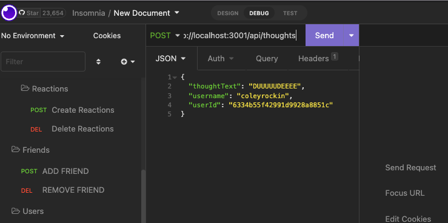

# Social-Network-API
Build an API for a social network using Express.js for routing, a MongoDB database, and the Mongoose ODM.

## Description
- GIVEN a social network API:
- WHEN I enter the command to invoke the application, THEN my server is started and the Mongoose models are synced to the MongoDB database.
- WHEN I open API GET routes in Insomnia for users and thoughts, THEN the data for each of these routes is displayed in a formatted JSON.
- WHEN I test API POST, PUT, and DELETE routes in Insomnia, THEN I am able to successfully create, update, and delete users and thoughts in my database.
- WHEN I test API POST and DELETE routes in Insomnia, THEN I am able to successfully create and delete reactions to thoughts and add and remove friends to a user’s friend list.

### User Story
```
AS A social media startup
I WANT an API for my social network that uses a NoSQL database
SO THAT my website can handle large amounts of unstructured data
```
### Walkthrough Video
- [Video of insomia demonstration]()

### Technology:
- Javascript
- Node.js
- Express.js
- MongoDB
- Mongoose
- Moment.js
- Insomnia (Test Routes)


### Installation

To run this project, install it locally using npm:

```
npm install
```

### Usage

After installing npm packages, the application will be invoked by using the following command:

```
npm start, and test routes with insomnia
```

### Screenshot of Insomnia


## Contact or questions
Boyd Roberts

[Coleyrockin Github](https://github.com/coleyrockin)

[Coleyrockin@aol.com](mailto:coleyrockin@aol.com)
