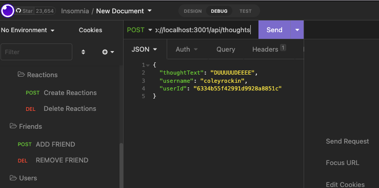

# Social Network API


## About

A RESTful API for a social network built with Express.js and MongoDB. Users can share thoughts, react to friends' thoughts, and manage a friend list. Designed for NoSQL to handle large amounts of unstructured data at scale.

## Features

- Full CRUD for users and thoughts
- Add and remove reactions to thoughts
- Add and remove friends from a user's friend list
- Mongoose virtuals for friend count and reaction count
- Moment.js formatted timestamps
- RESTful API routes tested with Insomnia

## Tech Stack

| Layer | Technology |
|-------|------------|
| Server | Node.js, Express.js 4 |
| Database | MongoDB, Mongoose 6 |
| Dates | Moment.js 2 |

## API Routes

| Method | Endpoint | Description |
|--------|----------|-------------|
| GET | /api/users | Get all users |
| GET | /api/users/:id | Get one user with thoughts and friends |
| POST | /api/users | Create a user |
| PUT | /api/users/:id | Update a user |
| DELETE | /api/users/:id | Delete a user and their thoughts |
| POST | /api/users/:userId/friends/:friendId | Add a friend |
| DELETE | /api/users/:userId/friends/:friendId | Remove a friend |
| GET | /api/thoughts | Get all thoughts |
| POST | /api/thoughts | Create a thought |
| POST | /api/thoughts/:thoughtId/reactions | Add a reaction |

## Getting Started

```bash
# Clone the repository
git clone https://github.com/coleyrockin/Social-Network-API.git
cd Social-Network-API

# Install dependencies
npm install

# Start the server (requires MongoDB running locally)
npm start
```

Test routes with Insomnia at `http://localhost:3001`.

## Project Structure

```
Social-Network-API/
├── config/
├── controllers/
├── models/
├── routes/
├── server.js
└── package.json
```

---

> Built by [coleyrockin](https://github.com/coleyrockin)# Social-Network-API
Build an API for a social network using Express.js for routing, a MongoDB database, and the Mongoose ODM.

## Description
- GIVEN a social network API:
- WHEN I enter the command to invoke the application, THEN my server is started and the Mongoose models are synced to the MongoDB database.
- WHEN I open API GET routes in Insomnia for users and thoughts, THEN the data for each of these routes is displayed in a formatted JSON.
- WHEN I test API POST, PUT, and DELETE routes in Insomnia, THEN I am able to successfully create, update, and delete users and thoughts in my database.
- WHEN I test API POST and DELETE routes in Insomnia, THEN I am able to successfully create and delete reactions to thoughts and add and remove friends to a user’s friend list.

### User Story
```
AS A social media startup
I WANT an API for my social network that uses a NoSQL database
SO THAT my website can handle large amounts of unstructured data
```
### Walkthrough Video
- [Video of insomia demonstration](https://drive.google.com/file/d/11LuewE6fflLXSRwz7C7gOzHGgWAHpkGb/view)

### Technology:
- Javascript
- Node.js
- Express.js
- MongoDB
- Mongoose
- Moment.js
- Insomnia (Test Routes)


### Installation

To run this project, install it locally using npm:

```
npm install
```

### Usage

After installing npm packages, the application will be invoked by using the following command:

```
npm start, and then test routes with insomnia
```

### Screenshot of Insomnia


## Contact or questions
Boyd Roberts

[Coleyrockin Github](https://github.com/coleyrockin)

[Coleyrockin@aol.com](mailto:coleyrockin@aol.com)
